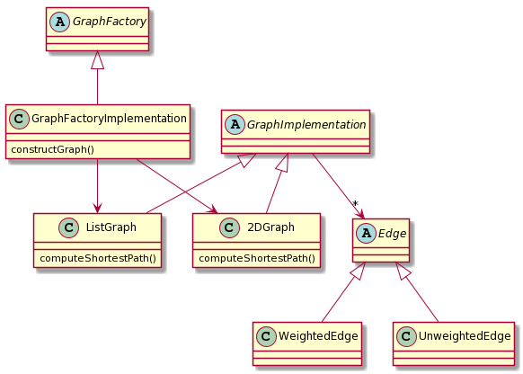

# Homework 3

## Date 5/8/2020

## Entry 1: Balance Abstraction with the Best Factory Pattern

### Option 1: Factory Method Approach

I think that using the Factory Method pattern in order to generate a common Graph abstraction that hides the differences between the two implementations of the
graphs is a very good approach. Both of these Graph implementations can be constructed in the same factory since there is no real different between the two
graphs aside from the data structures used.Therefore, it makes perfect sense, in my opinion, to approach this problem via the Factory Method Pattern. Again, the reasoning
behind this being the fact that this approach will **hide the differences** between the two separate representations of the Graphs.

I created a **very preliminary** sketch of what this might look like below:

Again, the idea behind this approach is the reasoning that we can hide the differences between the two graphs implementations and construct them in the same factory.

### Option 2: Abstract Factory Approach

