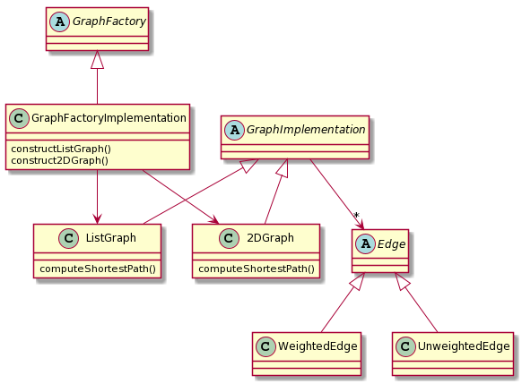
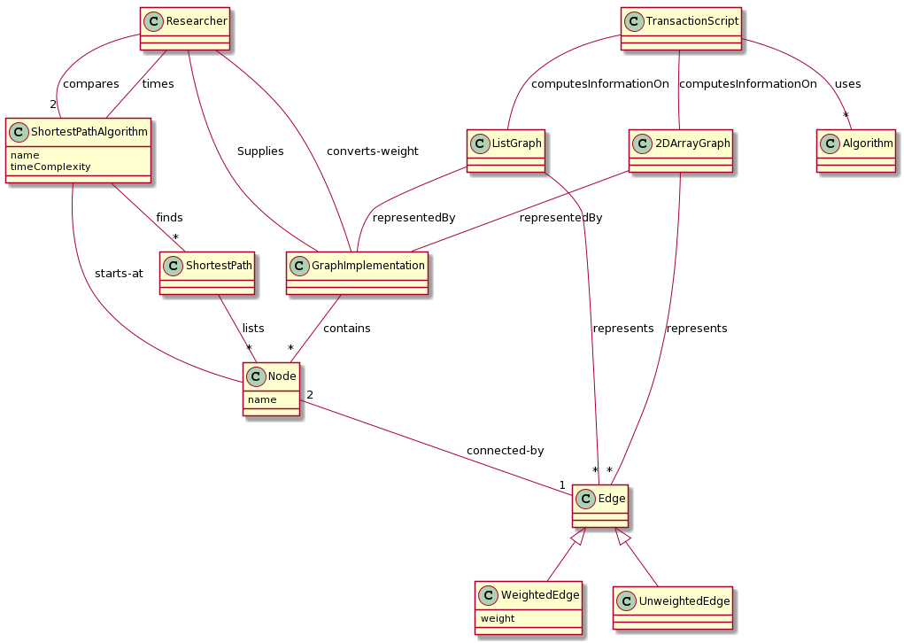
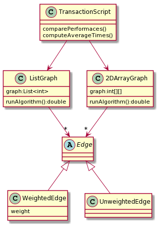

# Homework 3

## Date 5/8/2020

## Entry 1: Balance Abstraction with the Best Factory Pattern

### Option 1: Factory Method Approach

I think that using the Factory Method pattern in order to generate a common Graph abstraction that hides the differences between the two implementations of the
graphs is a very good approach. Both of these Graph implementations can be constructed in the same factory since there is no real different between the two
graphs aside from the data structures used.Therefore, it makes perfect sense, in my opinion, to approach this problem via the Factory Method Pattern. Again, the reasoning
behind this being the fact that this approach will **hide the differences** between the two separate representations of the Graphs.

I created a **very preliminary** sketch of what this might look like below:

Again, the idea behind this approach is the reasoning that we can hide the differences between the two graphs implementations and construct them in the same factory.

### Option 2: Abstract Factory Approach

The second option of using an abstract factory approach also could apply to our problem. Since there are substantial differences regarding the **data structures**
used by the graph implementations, it makes sense to group them up as **families of related objects**. This approach would mean that we have two separate factories
which both differently handle the construction of the graphs.

Again, I have made a **preliminary sketch** of what this might loook like regarding an implemetation below.

## Entry 2: Primary Functionality (with Singleton?)

We are going to refine the Domain Layer by satisfying **US1, US2, and US3**. For reference, I am restating those use cases below:

	1. US1: As a researcher, to identify the optimal shortest path implementation to use for a given graph, I want to compare the performance of an algorithm’s 2D Array implementation with its corresponding List implementation.
	2. US2: As a researcher, to identify performance bugs in a shortest-path implementation, I want to compute the average execution time of the implementation in different situations.
	3. US3: As a researcher, to compare the performance characteristics of algorithms on weighted and unweighted graphs, I want to easily convert an existing weighted graph to an unweighted graph.

Lets start by applying the ADD process to our design based off of the **Domain Model** provided in the document. I have posted it below for reference:

I have also put in the high level design so that we can understand how are changes will affect the overall existing architecture of the system:

#### ADD Iteration 1: Review Inputs

Our inputs here are going to be the user scenarios that are shown above the Domain Model, along with the Domain Model. These changes will be taking place within
the Domain layer of the high level architectural design above.

#### ADD Iteration 2: Establish Iteration Goal by Selecting Drivers

For this iteration, our goal is going to be to refine our Domain Model diagram so that we can satisfy our drivers, which are the user scenarios.

#### ADD Iteration 3: Choose One of More Elements of the System to Refine

We will be refining the Domain Model provided here, since it is really our only system element that we can adjust to accomplish our drivers.

#### ADD Iteration 4: Choose One or More Design Concepts that Satisfy the Selected Drivers

For this iteration, I will be apply the **Abstract Factory** pattern to our Domain Model. This will allow us to have factories which will separately construct
both the 2DGraph and ListGraph. Additionally, I will be instantiating another class called ComputationComparison. This class will take the responsibility of
**comparing the performances of the 2DArray implementation vs the ListGraph implementation**. This decision will satisfy **US1**. Additionally, we construct another
class with the responsibility of computing the average execution time for the graph implementations called AverageComparison. This particular decision will satisfy **US2**. If you reference
my preliminary sketch of my AbstractFactory pattern, you will notice that I already have handled the idea of unweighted graphs vs weighted graphs by providing
both weighted and unweighted edge objects which are contained in the abstract GraphImplementation class. I intend to use the same strategy so, thereby allowing
me to compare the graph implementations using both unweighted edges and weighted edges. This will address **US3** regarding our drivers.

#### ADD Iteration 5: Instantiate Architectural Elements, Allocate Responsibilities and Define Interfaces

Design Decision: Modify the Domain Model to reflect the concepts used in ADD Iteration 4.

#### ADD Iteration 6: Sketch Views and Record Design Decisions

Below is the modified Domain Model which includes the implementation of the Design Concepts used in ADD Iteration 4.

#### ADD Iteration 7: Perform Anaylsis of Current Design and Review Iteration Goal and Achievement of Design Purpose

| Addressed| Partially Addressed | Not Addressed  | Decisions Made during Iteration |
| :---     | :---                |     :---:      |          ---: |
| US1      |                     |                |   Use the abstract factory method to allow construction of both Graphs, allowing for comparison using the ComputationComparison class    |
| US2      |                     |                |   Construct a class called AverageComparison to compute the average of both graph implementations                             |
| US3      |                     |                |   Use the already structured edge implementations to implement an abstract edge which can be switched out at any time                        |

#### External Research

https://www.tutorialspoint.com/design_pattern/abstract_factory_pattern.htm

https://www.geeksforgeeks.org/abstract-factory-pattern/

## Entry 2 Singleton

Now we are going to use the approach of using a Single via a Transaction Script

#### ADD Iteration 1: Review Inputs

Our inputs here will simply be the User Scenarios and our knowledge of the Transaction Script Singleton pattern.

#### ADD Iteration 2: Establish Iteration Goal by Selecting Drivers

Our iteration goal here is to address the user scenarios laid out to up by applying the Transaction Script pattern to our problem.

#### ADD Iteration 3: Choose One of More Elements of the System to Refine

We will be developing the pattern from scratch, so the entire Domain Module will be refined here.

#### ADD Iteration 4: Choose One or More Design Concepts that Satisfy the Selected Drivers

We will be using the Singleton pattern to approach this problem. More specifically, we will be using the Singleton pattern applied via a Transaction Script class
to hold and execute all of the responsibilites for **US1, US2, and US3**.

#### ADD Iteration 5: Instantiate Architectural Elements, Allocate Responsibilities and Define Interfaces

Design Decision: Use the **Singleton Pattern** to develop a new Domain Model that will hold and execute all the logic regarding **US1 and US2**. We will handle
**US3** in the same manner regarding our other implementation; by using implementations of and abstract edge to represent weighted edges vs unweighted edges.

#### ADD Iteration 6: Sketch Views and Record Design Decisions

Below is my developed domain model, using the Transaction Script Pattern.

#### ADD Iteration 7: Perform Anaylsis of Current Design and Review Iteration Goal and Achievement of Design Purpose

| Addressed| Partially Addressed | Not Addressed  | Decisions Made during Iteration |
| :---     | :---                |     :---:      |          ---: |
| US1      |                     |                | Use the Transaction Script Singleton pattern to hold all computation logic within that Singleton class      |
| US2      |                     |                | Use the Transaction Script Singleton pattern to hold all computation logic within that Singleton class                |
| US3      |                     |                |  Use the already structured edge implementations to implement an abstract edge which can be switched out at any time   |

#### External Research

https://www.informit.com/articles/article.aspx?p=1398617

http://www.servicedesignpatterns.com/WebServiceImplementationStyles/TransactionScript

### Preferred Approach

Although, in my opinion, both designs are very good, I have to say that I like the Singleton Pattern approach more. The reason being is I think the factory
pattern is overkill in that I think it incorporates too much logic for a relatively simple problem. Yes, it is true that we will need to modify the Transaction
Script class if new graph implementations need to be tested; however there will be even more code required if we are using the Abstract Factory pattern. Again,
I think this can be solved simply by using the **Transaction Script Singleton pattern approach**.

Below is my **class diagram** for this approach. Note: I have left out the modules in the Domain Model that are superfluous to the drivers of our system.

